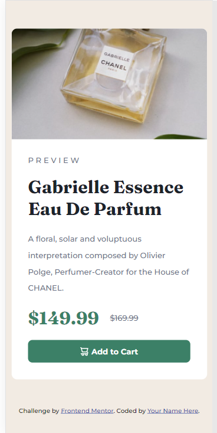

# Frontend Mentor - Product preview card component solution

This is a solution to the [Product preview card component challenge on Frontend Mentor](https://www.frontendmentor.io/challenges/product-preview-card-component-GO7UmttRfa). Frontend Mentor challenges help you improve your coding skills by building realistic projects.

## Table of contents

- [Overview](#overview)
  - [The challenge](#the-challenge)
  - [Screenshot](#screenshot)
  - [Links](#links)
- [My process](#my-process)
  - [Built with](#built-with)
  - [What I learned](#what-i-learned)
  - [Continued development](#continued-development)
  - [Useful resources](#useful-resources)
- [Author](#author)
- [Acknowledgments](#acknowledgments)

## Overview

This is product review design for a perfume collection

### The challenge

Users should be able to:

- View the optimal layout depending on their device's screen size
- See hover and focus states for interactive elements

### Screenshot




### Links

- Solution URL: [Add solution URL here](https://github.com/winsofttutorials/product-preview-card-component.git)
- Live Site URL: [Add live site URL here](https://winsofttutorials.github.io/product-preview-card-component/)

## My process

Fisrtly, I had an analysis of the both designs to understand the task.
I understood we had 3 components which is one bigger frame and two smaller frames of equal sizes.

I used grid layering to set my components.

### Built with

- Semantic HTML5 markup
- CSS custom properties
- Flexbox
- CSS Grid
- Mobile-first workflow
- [React](https://reactjs.org/) - JS library
- [Next.js](https://nextjs.org/) - React framework
- [Styled Components](https://styled-components.com/) - For styles

### What I learned

With this design I was able to work on my responsive design and it was really sweet working that out.

```html
<h1>Some HTML code I'm proud of</h1>
```

```css
.proud-of-this-css {
  color: papayawhip;
}
```

```js
const proudOfThisFunc = () => {
  console.log("🎉");
};
```

If you want more help with writing markdown, we'd recommend checking out [The Markdown Guide](https://www.markdownguide.org/) to learn more.

### Continued development

I would like to and a next button and also a payout form page.

### Useful resources

- [Example resource 1](https://www.example.com) - This helped me for XYZ reason. I really liked this pattern and will use it going forward.
- [Example resource 2](https://www.example.com) - This is an amazing article which helped me finally understand XYZ. I'd recommend it to anyone still learning this concept.

## Author

- Website - [IFIDI W. EPHOD](https://www.your-site.com)
- Frontend Mentor - [@winsofttutorials](https://www.frontendmentor.io/profile/winsofttutorials)
- Twitter - [@IFIDIKUROEPHOD](https://www.twitter.com/IFIDIKUROEPHOD)

## Acknowledgments

Special appreciation to frontendmentor challenge for this opportunity to grow my skills on frontend. And to my mentor @Avinash who has really given me great ideas on problem solving.
